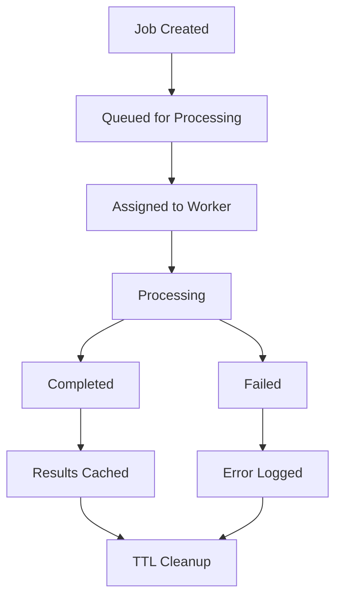
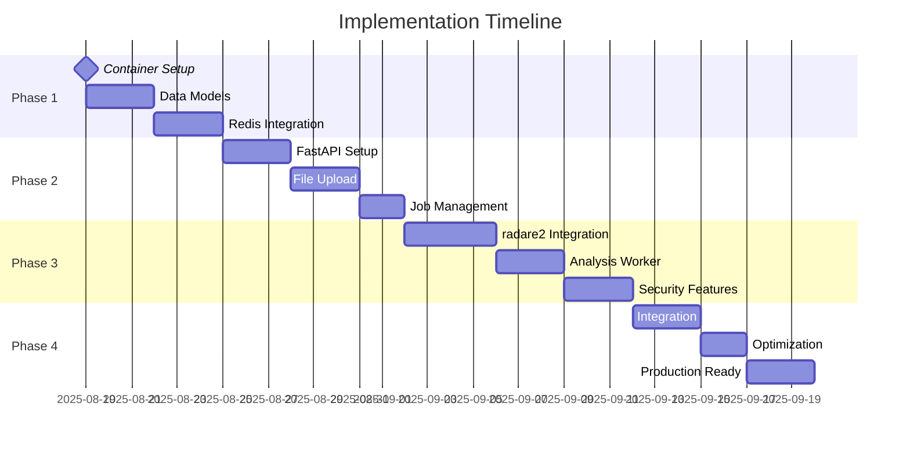

# Technical Design Document: Phase 1 Integrated System
## Multi-Platform Binary Analysis Engine + RESTful API Interface

## Executive Summary

This Technical Design Document outlines the integrated system architecture for Phase 1 of the bin2nlp project, combining the Multi-Platform Binary Analysis Engine with the RESTful API Interface. The design implements a multi-container architecture that enables elastic scaling, efficient resource utilization, and clear separation of concerns while maintaining the performance targets specified in the Project PRD.

### Business Goals to Technical Approach Alignment

**Primary Business Goals:**
- 90% time reduction in binary analysis → Automated processing with async job queues
- Quality analysis insights → Structured output with confidence scoring
- Technical feasibility demonstration → Production-ready containerized architecture
- Foundation for SaaS commercialization → Stateless, horizontally scalable design

**Technical Strategy:**
The system uses a queue-based architecture with separate service containers to enable independent scaling of API endpoints and analysis processing. Redis serves as both the job queue and result cache, while shared volume mounts enable efficient file transfer between containers without security risks.

## System Architecture

### High-Level Architecture Overview

```
┌─────────────────┐    ┌─────────────────┐    ┌─────────────────┐
│   Load Balancer │    │   File Storage  │    │   Monitoring    │
│                 │    │   (Shared Vol)  │    │   & Logging     │
└─────────┬───────┘    └─────────┬───────┘    └─────────────────┘
          │                      │                      │
          ▼                      ▼                      ▼
┌─────────────────┐    ┌─────────────────┐    ┌─────────────────┐
│   API Container │◄───┤   Redis Cache   │───►│Analysis Workers │
│   (FastAPI)     │    │   & Job Queue   │    │  (r2pipe +      │
│                 │    │                 │    │   Analysis      │
│   • Auth        │    │ • Job Queue     │    │   Engine)       │
│   • File Upload │    │ • Result Cache  │    │                 │
│   • Job Mgmt    │    │ • Rate Limiting │    │ • radare2       │
│   • Results     │    │ • Session Data  │    │ • File Proc     │
└─────────────────┘    └─────────────────┘    │ • Security Scan │
                                              └─────────────────┘
```

### Component Relationships and Data Flow

**File Upload & Analysis Request Flow:**
1. **Client** uploads binary file to API via pre-signed URL or direct upload
2. **API Container** validates file, creates analysis job, stores in Redis queue
3. **Analysis Worker** picks up job from Redis queue, processes file from shared volume
4. **Analysis Worker** stores structured results in Redis cache with TTL
5. **API Container** retrieves results from cache and returns to client

**Container Communication Patterns:**
- **API ↔ Redis**: Direct connection for cache ops, job submission, status tracking
- **Worker ↔ Redis**: Job polling, result storage, status updates
- **API ↔ Storage**: File validation and metadata extraction
- **Worker ↔ Storage**: Binary file processing and temporary file management

### Integration Points with Future Systems

**LLM Integration Readiness:**
- Analysis results structured for LLM consumption
- Worker containers can be extended with LLM processing modules
- Redis job queue supports multi-stage processing workflows

**Enterprise Features Preparation:**
- Authentication system extensible to multi-tenant models
- Container architecture supports enterprise orchestration platforms
- Monitoring hooks for usage analytics and billing systems

## Technical Stack

### Core Technologies and Justification

**API Layer:**
- **FastAPI 0.104+**: Automatic OpenAPI docs, async support, type validation
- **Uvicorn**: High-performance ASGI server with auto-reload for development
- **Pydantic v2**: Data validation, serialization, and schema generation
- **python-multipart**: File upload handling with memory efficiency

**Analysis Engine:**
- **radare2 (latest stable)**: Core binary analysis with floating version strategy
- **r2pipe**: Python integration with radare2 for analysis automation
- **asyncio**: Non-blocking I/O for file processing and external service calls
- **structlog**: Structured logging with context propagation

**Infrastructure:**
- **Redis 7.x**: Job queue, result cache, rate limiting, session storage
- **Docker Compose**: Multi-container orchestration for development and deployment
- **Python 3.11+**: Modern async features, performance improvements, type hints

**Testing & Quality:**
- **pytest**: Unit and integration testing with async support
- **pytest-asyncio**: Async test execution and fixture management
- **pytest-cov**: Coverage reporting with branch analysis
- **black + isort + mypy**: Code formatting, import sorting, type checking

### Dependencies and Version Requirements

**Python Package Dependencies:**
```python
# Core Application
fastapi[all] >= 0.104.0
uvicorn[standard] >= 0.24.0
pydantic >= 2.4.0
redis >= 5.0.0
r2pipe >= 1.9.0

# Async & Concurrency
aiofiles >= 23.2.0
httpx >= 0.25.0

# Monitoring & Logging
structlog >= 23.2.0
prometheus-client >= 0.19.0

# Development & Testing
pytest >= 7.4.0
pytest-asyncio >= 0.21.0
pytest-cov >= 4.1.0
black >= 23.9.0
isort >= 5.12.0
mypy >= 1.6.0
```

**Container Dependencies:**
```dockerfile
# Analysis Worker Container
FROM python:3.11-slim
RUN apt-get update && apt-get install -y \
    radare2 \
    binutils \
    file \
    && rm -rf /var/lib/apt/lists/*
```

## Data Design

### Database Schema Approach

**Redis Data Structures:**

**Job Queue (Lists):**
```redis
# Job queue for analysis requests
analysis_jobs:pending    # List of job IDs awaiting processing
analysis_jobs:processing # List of currently processing job IDs
analysis_jobs:completed  # List of completed job IDs (TTL: 7 days)
analysis_jobs:failed     # List of failed job IDs (TTL: 7 days)
```

**Job Metadata (Hashes):**
```redis
# Job details and status tracking
job:{job_id}  # Hash containing job metadata
{
  "id": "job_uuid",
  "api_key_id": "key_hash",
  "file_path": "/shared/uploads/file.bin",
  "config": "{json_analysis_config}",
  "status": "pending|processing|completed|failed",
  "created_at": "iso_timestamp",
  "started_at": "iso_timestamp",
  "completed_at": "iso_timestamp",
  "worker_id": "container_id",
  "error_message": "error_details"
}
```

**Result Cache (Strings with JSON):**
```redis
# Analysis results cached with TTL
result:{job_id}    # JSON analysis results (TTL: 24 hours)
summary:{job_id}   # JSON summary results (TTL: 24 hours)
functions:{job_id} # JSON function analysis (TTL: 24 hours)
security:{job_id}  # JSON security analysis (TTL: 24 hours)
strings:{job_id}   # JSON string extraction (TTL: 24 hours)
```

### Data Relationship Patterns

**File Upload to Analysis Workflow:**
```python
@dataclass
class AnalysisJob:
    job_id: str              # UUID4 for unique identification
    api_key_id: str          # Authentication context
    file_reference: str      # Path in shared volume
    config: AnalysisConfig   # Analysis parameters
    status: JobStatus        # Workflow state tracking
    timestamps: JobTimestamps # Performance monitoring
    results: Optional[AnalysisResult] # Cached analysis output
```

**Analysis Configuration Structure:**
```python
@dataclass 
class AnalysisConfig:
    analysis_depth: AnalysisDepth  # QUICK, STANDARD, COMPREHENSIVE
    focus_areas: List[str]         # ["security", "functions", "strings"]
    timeout_seconds: int           # Processing time limit
    priority: JobPriority          # NORMAL, HIGH for queue ordering
    file_metadata: FileMetadata    # Original filename, size, format hints
```

### Validation Strategy and Consistency

**Input Validation Layers:**
1. **API Layer**: Pydantic models validate request format and constraints
2. **Business Logic**: Custom validators check business rules and quotas
3. **File Layer**: Binary format validation before analysis processing
4. **Analysis Layer**: radare2 compatibility and resource limit checks

**Data Consistency Approach:**
- **Job State Consistency**: Redis transactions for atomic job state updates
- **Result Consistency**: Cache invalidation on analysis engine version changes
- **File Consistency**: Checksum validation for file integrity across containers
- **Configuration Consistency**: Schema versioning for analysis config evolution

### Migration Strategy and Data Preservation

**Development to Production Migration:**
- Redis data is ephemeral by design (cache + job queue only)
- Job history retained for 7 days for debugging and performance analysis
- Configuration schema evolution handled via versioned config objects
- Container image versioning enables rollback of analysis engine changes

**Data Backup Strategy:**
- No persistent data backup required (security by design)
- Container logs preserved for debugging and performance monitoring
- Analysis configuration templates stored in version control
- Performance metrics exported to external monitoring systems

## API Design

### API Design Patterns and Conventions

**RESTful Resource Design:**
```python
# Authentication & System
GET  /api/v1/health                    # System health check
GET  /api/v1/auth/validate             # API key validation
GET  /api/v1/formats                   # Supported file formats

# File Upload Management  
POST /api/v1/upload                    # Request pre-signed upload URL
POST /api/v1/upload/validate           # Validate uploaded file

# Analysis Operations
POST /api/v1/analyze                   # Submit analysis request
GET  /api/v1/analyze/{analysis_id}     # Get analysis summary
GET  /api/v1/analyze/{analysis_id}/functions   # Function details
GET  /api/v1/analyze/{analysis_id}/security    # Security analysis
GET  /api/v1/analyze/{analysis_id}/strings     # String extraction

# Job Management
GET  /api/v1/jobs                      # List user's jobs
GET  /api/v1/jobs/{job_id}             # Job details
GET  /api/v1/jobs/{job_id}/status      # Job status polling
DELETE /api/v1/jobs/{job_id}           # Cancel job
```

**FastAPI Implementation Patterns:**
```python
# Dependency injection for shared services
async def get_redis() -> Redis:
    return redis_pool.get_connection()

async def get_analysis_service() -> AnalysisService:
    return AnalysisService(redis=await get_redis())

# Route definition with validation
@router.post("/analyze", response_model=AnalysisResponse)
async def submit_analysis(
    request: AnalysisRequest,
    background_tasks: BackgroundTasks,
    analysis_service: AnalysisService = Depends(get_analysis_service),
    api_key: str = Depends(validate_api_key)
) -> AnalysisResponse:
    """Submit binary file for analysis."""
```

### Data Flow and Transformation Strategy

**Request Processing Pipeline:**
1. **Authentication**: API key validation and rate limit checking
2. **Validation**: Request schema validation via Pydantic models
3. **File Handling**: Upload validation and shared volume storage
4. **Job Creation**: Redis job queue submission with metadata
5. **Response**: Immediate response with job ID and polling endpoints

**Response Transformation Layers:**
```python
# Raw analysis engine output → Structured API response
class ResponseTransformer:
    async def transform_analysis_result(
        self, 
        raw_result: Dict, 
        request_config: AnalysisConfig
    ) -> AnalysisResponse:
        """Transform engine output to API response format."""
        
    async def apply_response_filtering(
        self, 
        result: AnalysisResponse,
        detail_level: DetailLevel
    ) -> AnalysisResponse:
        """Filter response based on requested detail level."""
```

### Error Handling Strategy and Consistency

**Error Response Format:**
```python
@dataclass
class APIError:
    success: bool = False
    error: ErrorDetails
    request_id: str
    timestamp: str

@dataclass  
class ErrorDetails:
    code: str                    # INVALID_FILE_FORMAT, ANALYSIS_TIMEOUT
    message: str                 # Human-readable error description
    details: str                 # Technical details for debugging
    remediation: str             # Suggested user actions
    documentation_url: str       # Link to relevant documentation
```

**Error Handling Layers:**
1. **Request Validation Errors**: Pydantic validation with field-specific messages
2. **Business Logic Errors**: Custom exceptions with structured error responses
3. **Analysis Engine Errors**: Error object transformation from engine to HTTP
4. **Infrastructure Errors**: Rate limiting, service unavailability, resource exhaustion

### Security and Performance Design Principles

**API Security Patterns:**
- **Authentication**: Bearer token validation with Redis-cached API keys
- **Rate Limiting**: Token bucket algorithm implemented in Redis
- **Input Validation**: Multi-layer validation (schema, business rules, security)
- **Output Sanitization**: Structured responses with no raw data exposure

**Performance Optimization:**
- **Async Everywhere**: All I/O operations use async/await patterns
- **Connection Pooling**: Redis connection pool for efficient resource usage
- **Response Caching**: Aggressive caching of analysis results with smart TTL
- **Streaming Uploads**: Large file uploads handled without memory buffering

## Component Architecture

### Component Organization and Hierarchy

**Modular Monolith Structure:**
```
src/
├── api/                    # FastAPI application layer
│   ├── routes/            # Endpoint definitions by resource
│   │   ├── __init__.py
│   │   ├── analysis.py    # Analysis endpoints
│   │   ├── auth.py        # Authentication endpoints
│   │   ├── jobs.py        # Job management endpoints
│   │   └── upload.py      # File upload endpoints
│   ├── middleware/        # Custom middleware components
│   │   ├── __init__.py
│   │   ├── auth.py        # Authentication middleware
│   │   ├── rate_limit.py  # Rate limiting middleware
│   │   └── logging.py     # Request/response logging
│   ├── dependencies/      # FastAPI dependency injection
│   │   ├── __init__.py
│   │   ├── redis.py       # Redis connection management
│   │   ├── services.py    # Service layer dependencies
│   │   └── validation.py  # Custom validators
│   └── main.py           # FastAPI application setup
├── analysis/              # Binary analysis engine
│   ├── engines/          # Analysis engine implementations
│   │   ├── __init__.py
│   │   ├── radare2.py    # radare2 integration wrapper
│   │   ├── file_parser.py # File format detection
│   │   └── security.py   # Security pattern detection
│   ├── processors/       # Analysis workflow coordination
│   │   ├── __init__.py
│   │   ├── job_processor.py # Job queue processing
│   │   ├── result_builder.py # Result compilation
│   │   └── error_handler.py # Analysis error handling
│   └── workers/          # Background worker processes
│       ├── __init__.py
│       ├── analysis_worker.py # Main worker process
│       └── health_checker.py  # Worker health monitoring
├── models/               # Data models and schemas
│   ├── api/             # API request/response models
│   │   ├── __init__.py
│   │   ├── analysis.py  # Analysis-related models
│   │   ├── auth.py      # Authentication models
│   │   └── jobs.py      # Job management models
│   ├── analysis/        # Analysis engine models
│   │   ├── __init__.py
│   │   ├── config.py    # Analysis configuration
│   │   ├── results.py   # Analysis result structures
│   │   └── files.py     # File metadata models
│   └── shared/          # Shared data structures
│       ├── __init__.py
│       ├── enums.py     # System-wide enumerations
│       └── base.py      # Base model classes
├── cache/               # Redis integration layer
│   ├── __init__.py
│   ├── job_queue.py     # Job queue management
│   ├── result_cache.py  # Analysis result caching
│   ├── rate_limiter.py  # Rate limiting implementation
│   └── session.py       # Session and temporary data
└── core/                # Shared utilities and configuration
    ├── __init__.py
    ├── config.py        # Application configuration
    ├── exceptions.py    # Custom exception hierarchy
    ├── logging.py       # Structured logging setup
    └── utils.py         # Utility functions
```

### Reusability Patterns and Abstraction

**Service Layer Abstraction:**
```python
# Abstract base for analysis services
class BaseAnalysisService(ABC):
    @abstractmethod
    async def submit_job(self, config: AnalysisConfig) -> JobID:
        """Submit analysis job to processing queue."""
        
    @abstractmethod  
    async def get_job_status(self, job_id: JobID) -> JobStatus:
        """Retrieve current job processing status."""
        
    @abstractmethod
    async def get_job_results(self, job_id: JobID) -> AnalysisResult:
        """Retrieve completed analysis results."""

# Concrete implementation for Redis-backed service
class RedisAnalysisService(BaseAnalysisService):
    def __init__(self, redis: Redis, job_queue: JobQueue):
        self.redis = redis
        self.job_queue = job_queue
```

**Configuration Management Pattern:**
```python
# Environment-based configuration with validation
class Settings(BaseSettings):
    # Redis Configuration
    redis_url: str = "redis://localhost:6379"
    redis_max_connections: int = 10
    
    # Analysis Configuration  
    max_file_size_mb: int = 100
    analysis_timeout_seconds: int = 1200
    result_cache_ttl_hours: int = 24
    
    # Container Configuration
    shared_volume_path: Path = "/shared"
    worker_concurrency: int = 4
    
    class Config:
        env_file = ".env"
        case_sensitive = False
```

### Data Flow and Communication Patterns

**Inter-Container Communication:**
```python
# Job queue interface for async processing
class JobQueue:
    async def enqueue_job(self, job: AnalysisJob) -> bool:
        """Add job to processing queue with priority handling."""
        
    async def dequeue_job(self, worker_id: str) -> Optional[AnalysisJob]:
        """Get next job for processing with worker assignment."""
        
    async def update_job_status(self, job_id: str, status: JobStatus) -> bool:
        """Update job status with atomic Redis operations."""
        
    async def get_queue_stats(self) -> QueueStats:
        """Get queue depth and processing statistics."""
```

**File Processing Communication:**
```python
# Shared volume file operations
class SharedFileManager:
    def __init__(self, shared_path: Path):
        self.shared_path = shared_path
        
    async def store_upload(self, file_data: bytes, job_id: str) -> Path:
        """Store uploaded file in shared volume with job isolation."""
        
    async def get_file_path(self, job_id: str) -> Path:
        """Get file path for analysis worker processing."""
        
    async def cleanup_files(self, job_id: str) -> bool:
        """Remove temporary files after analysis completion."""
```

### Separation of Concerns Guidance

**Layer Responsibility Matrix:**
- **API Layer**: HTTP protocol, authentication, request validation, response formatting
- **Service Layer**: Business logic, job orchestration, result aggregation, error handling
- **Analysis Layer**: Binary processing, radare2 integration, security scanning, result generation
- **Cache Layer**: Data persistence, job queuing, rate limiting, session management
- **Core Layer**: Configuration, logging, utilities, shared exceptions

**Cross-Cutting Concerns:**
- **Logging**: Structured logging with request correlation IDs across all layers
- **Monitoring**: Performance metrics collection at service boundaries
- **Error Handling**: Exception translation and propagation through layer boundaries
- **Configuration**: Environment-based configuration injection at container startup

## State Management

### Application State Organization Principles

**Stateless API Design:**
- **No Server-Side Sessions**: All request context provided via API keys and request data
- **Idempotent Operations**: GET, PUT, DELETE operations can be safely retried
- **Request Correlation**: Each request has correlation ID for distributed tracing
- **Container Independence**: API containers can be added/removed without state loss

**Redis State Categories:**
```python
# Transient job processing state
class JobState:
    pending_jobs: List[JobID]      # Jobs awaiting processing
    active_jobs: Dict[JobID, WorkerID]  # Currently processing jobs
    completed_jobs: Set[JobID]     # Recently completed (TTL: 7 days)
    failed_jobs: Dict[JobID, ErrorDetails]  # Failed jobs with error info

# Cached analysis results
class ResultState:
    analysis_cache: Dict[JobID, AnalysisResult]  # Full results (TTL: 24h)
    summary_cache: Dict[JobID, SummaryResult]    # Quick summaries (TTL: 24h)
    
# Rate limiting and authentication state  
class AuthState:
    api_key_usage: Dict[KeyID, UsageStats]       # Usage tracking per key
    rate_limit_buckets: Dict[KeyID, TokenBucket] # Rate limiting counters
```

### State Flow Patterns and Update Strategies

**Job Lifecycle State Flow:**


**State Update Strategies:**
```python
# Atomic job status updates with Redis transactions
class JobStateManager:
    async def transition_job_status(
        self, 
        job_id: str, 
        from_status: JobStatus, 
        to_status: JobStatus,
        worker_id: Optional[str] = None
    ) -> bool:
        """Atomically update job status with optimistic locking."""
        async with self.redis.pipeline(transaction=True) as pipe:
            # Watch job for concurrent modifications
            await pipe.watch(f"job:{job_id}")
            
            # Verify current status matches expected
            current_status = await pipe.hget(f"job:{job_id}", "status")
            if current_status != from_status.value:
                return False
                
            # Update status and metadata atomically
            pipe.multi()
            pipe.hset(f"job:{job_id}", {
                "status": to_status.value,
                "updated_at": datetime.utcnow().isoformat(),
                "worker_id": worker_id
            })
            await pipe.execute()
            return True
```

### Side Effects Handling Approach

**File System Side Effects:**
- **Upload Cleanup**: Automatic file deletion after analysis completion or timeout
- **Temp File Management**: Worker-specific temporary directories with process cleanup
- **Disk Space Monitoring**: Alerts when shared volume approaches capacity limits

**External Service Side Effects:**
```python
# Graceful radare2 process management
class RadareProcessManager:
    async def execute_analysis(
        self, 
        file_path: Path, 
        timeout: int
    ) -> AnalysisResult:
        """Execute radare2 analysis with timeout and cleanup."""
        process = None
        try:
            # Start radare2 process with resource limits
            process = await asyncio.create_subprocess_exec(
                "r2", "-A", str(file_path),
                stdout=asyncio.subprocess.PIPE,
                stderr=asyncio.subprocess.PIPE,
                limit=1024*1024*100  # 100MB output limit
            )
            
            # Wait for completion with timeout
            stdout, stderr = await asyncio.wait_for(
                process.communicate(), 
                timeout=timeout
            )
            
            # Process results
            return self.parse_radare_output(stdout)
            
        except asyncio.TimeoutError:
            if process:
                process.terminate()
                await process.wait()
            raise AnalysisTimeoutError(f"Analysis timed out after {timeout}s")
            
        finally:
            # Ensure process cleanup
            if process and process.returncode is None:
                process.kill()
                await process.wait()
```

### Caching Strategy and Data Consistency

**Multi-Layer Caching Architecture:**
```python
# API-level caching with smart invalidation
class AnalysisResultCache:
    def __init__(self, redis: Redis):
        self.redis = redis
        self.default_ttl = 24 * 3600  # 24 hours
        
    async def cache_analysis_result(
        self, 
        job_id: str, 
        result: AnalysisResult,
        ttl: Optional[int] = None
    ) -> bool:
        """Cache analysis result with automatic compression."""
        ttl = ttl or self.default_ttl
        
        # Cache different detail levels separately
        await asyncio.gather(
            self.redis.setex(
                f"result:full:{job_id}",
                ttl,
                self.compress_json(result.model_dump())
            ),
            self.redis.setex(
                f"result:summary:{job_id}",
                ttl,
                self.compress_json(result.summary.model_dump())
            ),
            self.redis.setex(
                f"result:functions:{job_id}",
                ttl,
                self.compress_json(result.functions.model_dump())
            )
        )
        
    async def invalidate_analysis_cache(self, pattern: str) -> int:
        """Invalidate cached results matching pattern."""
        keys = await self.redis.keys(pattern)
        if keys:
            return await self.redis.delete(*keys)
        return 0
```

**Cache Consistency Policies:**
- **Cache Invalidation**: Results invalidated on analysis engine version changes
- **TTL Management**: Configurable TTL based on analysis complexity and resource usage
- **Memory Management**: LRU eviction policy with memory usage monitoring
- **Warming Strategy**: Pre-computation of common analysis summaries during off-peak hours

## Security Considerations

### Authentication and Authorization Strategy

**API Key-Based Authentication:**
```python
# Secure API key management with hashing
class APIKeyManager:
    def __init__(self, redis: Redis):
        self.redis = redis
        
    async def validate_api_key(self, provided_key: str) -> Optional[APIKeyInfo]:
        """Validate API key and return associated metadata."""
        # Hash provided key for secure comparison
        key_hash = self.hash_api_key(provided_key)
        
        # Retrieve key metadata from Redis
        key_data = await self.redis.hgetall(f"api_key:{key_hash}")
        if not key_data or not key_data.get("is_active"):
            return None
            
        # Update last used timestamp
        await self.redis.hset(
            f"api_key:{key_hash}",
            "last_used",
            datetime.utcnow().isoformat()
        )
        
        return APIKeyInfo.from_redis_data(key_data)
        
    def hash_api_key(self, key: str) -> str:
        """Secure hash of API key using SHA-256 + salt."""
        salt = os.environ.get("API_KEY_SALT", "default_salt")
        return hashlib.sha256(f"{key}{salt}".encode()).hexdigest()
```

**Rate Limiting Implementation:**
```python
# Token bucket rate limiting with Redis
class RateLimiter:
    def __init__(self, redis: Redis):
        self.redis = redis
        
    async def check_rate_limit(
        self, 
        api_key_id: str, 
        limit: int = 100, 
        window: int = 3600
    ) -> RateLimitResult:
        """Check if request is within rate limits."""
        key = f"rate_limit:{api_key_id}"
        
        # Use Redis sliding window approach
        now = int(time.time())
        window_start = now - window
        
        async with self.redis.pipeline() as pipe:
            # Remove expired entries
            pipe.zremrangebyscore(key, 0, window_start)
            
            # Count current requests in window
            pipe.zcard(key)
            
            # Add current request
            pipe.zadd(key, {str(now): now})
            
            # Set expiration
            pipe.expire(key, window)
            
            results = await pipe.execute()
            
        current_count = results[1]
        
        if current_count >= limit:
            return RateLimitResult(
                allowed=False,
                remaining=0,
                reset_time=window_start + window
            )
            
        return RateLimitResult(
            allowed=True,
            remaining=limit - current_count - 1,
            reset_time=window_start + window
        )
```

### Data Validation and Sanitization Approach

**Multi-Layer Input Validation:**
```python
# Comprehensive file validation pipeline
class FileValidator:
    def __init__(self):
        self.max_size = 100 * 1024 * 1024  # 100MB
        self.allowed_types = {
            'application/octet-stream',
            'application/x-executable',
            'application/x-dosexec'
        }
        
    async def validate_upload(self, file_data: bytes, filename: str) -> ValidationResult:
        """Comprehensive file validation before processing."""
        # Size validation
        if len(file_data) > self.max_size:
            return ValidationResult(
                valid=False,
                error="File size exceeds 100MB limit"
            )
            
        # Basic format detection
        detected_format = self.detect_file_format(file_data)
        if not detected_format:
            return ValidationResult(
                valid=False,
                error="Unable to detect file format"
            )
            
        # Security scanning
        security_result = await self.basic_security_scan(file_data)
        if security_result.is_malicious:
            return ValidationResult(
                valid=False,
                error="File flagged as potentially malicious"
            )
            
        return ValidationResult(
            valid=True,
            detected_format=detected_format,
            security_assessment=security_result
        )
        
    def detect_file_format(self, data: bytes) -> Optional[FileFormat]:
        """Detect binary file format using magic bytes."""
        # PE format detection
        if data.startswith(b'MZ'):
            return FileFormat.PE
            
        # ELF format detection  
        if data.startswith(b'\x7fELF'):
            return FileFormat.ELF
            
        # Mach-O format detection
        if data.startswith(b'\xfe\xed\xfa\xce') or data.startswith(b'\xce\xfa\xed\xfe'):
            return FileFormat.MACHO
            
        return None
```

**Request Sanitization:**
```python
# Input sanitization for analysis parameters
class ParameterSanitizer:
    @staticmethod
    def sanitize_analysis_config(config: Dict[str, Any]) -> AnalysisConfig:
        """Sanitize and validate analysis configuration."""
        # Timeout bounds checking
        timeout = config.get('timeout_seconds', 300)
        timeout = max(30, min(1200, int(timeout)))  # 30s - 20min range
        
        # Analysis depth validation
        depth = config.get('analysis_depth', 'standard')
        if depth not in ['quick', 'standard', 'comprehensive']:
            depth = 'standard'
            
        # Focus areas validation
        focus_areas = config.get('focus_areas', [])
        valid_areas = {'security', 'functions', 'strings', 'imports'}
        focus_areas = [area for area in focus_areas if area in valid_areas]
        
        return AnalysisConfig(
            analysis_depth=AnalysisDepth(depth),
            timeout_seconds=timeout,
            focus_areas=focus_areas
        )
```

### Security Best Practices Implementation

**Container Security:**
```dockerfile
# Analysis worker container security hardening
FROM python:3.11-slim

# Create non-root user for security
RUN groupadd -r analysis && useradd -r -g analysis analysis

# Install radare2 and dependencies
RUN apt-get update && apt-get install -y \
    radare2 \
    binutils \
    file \
    && rm -rf /var/lib/apt/lists/* \
    && apt-get clean

# Set up secure working directory
WORKDIR /app
RUN chown -R analysis:analysis /app

# Install Python dependencies
COPY requirements.txt .
RUN pip install --no-cache-dir -r requirements.txt

# Copy application code
COPY src/ ./src/
RUN chown -R analysis:analysis ./src/

# Switch to non-root user
USER analysis

# Health check
HEALTHCHECK --interval=30s --timeout=10s --start-period=5s --retries=3 \
    CMD python -c "import redis; redis.Redis().ping()" || exit 1

# Run worker process
CMD ["python", "-m", "src.analysis.workers.analysis_worker"]
```

**File Processing Security:**
```python
# Secure file processing with sandboxing
class SecureFileProcessor:
    def __init__(self, temp_dir: Path):
        self.temp_dir = temp_dir
        self.temp_dir.chmod(0o700)  # Restrict directory permissions
        
    async def process_file_securely(
        self, 
        file_data: bytes, 
        job_id: str
    ) -> Path:
        """Process uploaded file with security isolation."""
        # Create job-specific temp directory
        job_dir = self.temp_dir / job_id
        job_dir.mkdir(mode=0o700, exist_ok=True)
        
        # Write file with restricted permissions
        file_path = job_dir / "binary_file"
        file_path.write_bytes(file_data)
        file_path.chmod(0o600)  # Read/write for owner only
        
        return file_path
        
    async def cleanup_job_files(self, job_id: str) -> bool:
        """Securely delete job-related temporary files."""
        job_dir = self.temp_dir / job_id
        if job_dir.exists():
            # Secure deletion of sensitive files
            for file_path in job_dir.rglob("*"):
                if file_path.is_file():
                    # Overwrite file before deletion (basic secure delete)
                    file_size = file_path.stat().st_size
                    with file_path.open("r+b") as f:
                        f.write(b'\x00' * file_size)
                        f.flush()
                        os.fsync(f.fileno())
                    file_path.unlink()
                    
            job_dir.rmdir()
            return True
        return False
```

### Privacy and Compliance Guidance

**Data Privacy Implementation:**
- **No Persistent Storage**: Binary files deleted immediately after analysis
- **Result Anonymization**: Analysis results contain no personally identifiable information
- **Audit Logging**: Request metadata logged without sensitive content
- **Data Minimization**: Only essential metadata retained for debugging and performance

**Compliance Framework:**
```python
# Compliance monitoring and enforcement
class ComplianceMonitor:
    def __init__(self, redis: Redis):
        self.redis = redis
        
    async def log_data_access(
        self, 
        api_key_id: str, 
        operation: str, 
        resource_id: str
    ) -> None:
        """Log data access for compliance auditing."""
        audit_entry = {
            "timestamp": datetime.utcnow().isoformat(),
            "api_key_id": api_key_id,
            "operation": operation,
            "resource_id": resource_id,
            "ip_address": "redacted",  # IP addresses not stored
            "user_agent": "redacted"   # User agents not stored
        }
        
        # Store audit log with 90-day retention
        await self.redis.lpush(
            "audit_log",
            json.dumps(audit_entry)
        )
        await self.redis.expire("audit_log", 90 * 24 * 3600)
        
    async def enforce_data_retention(self) -> int:
        """Enforce data retention policies."""
        deleted_count = 0
        
        # Remove expired job data
        expired_jobs = await self.redis.zrangebyscore(
            "job_expiry",
            0,
            int(time.time())
        )
        
        for job_id in expired_jobs:
            await self.delete_job_data(job_id)
            deleted_count += 1
            
        return deleted_count
```

## Performance & Scalability

### Performance Optimization Principles

**Async-First Architecture:**
```python
# Non-blocking I/O for all external operations
class AnalysisService:
    def __init__(self, redis_pool: ConnectionPool):
        self.redis_pool = redis_pool
        self.http_client = httpx.AsyncClient(
            timeout=httpx.Timeout(30.0),
            limits=httpx.Limits(max_connections=100)
        )
        
    async def submit_analysis_job(
        self, 
        file_data: bytes, 
        config: AnalysisConfig
    ) -> JobSubmissionResult:
        """Submit job with parallel operations."""
        # Execute validation and storage concurrently
        validation_task = asyncio.create_task(
            self.validate_file(file_data)
        )
        storage_task = asyncio.create_task(
            self.store_file_in_shared_volume(file_data)
        )
        
        # Wait for both operations
        validation_result, file_path = await asyncio.gather(
            validation_task,
            storage_task
        )
        
        if not validation_result.valid:
            await self.cleanup_stored_file(file_path)
            raise ValidationError(validation_result.error)
            
        # Submit to job queue
        job_id = await self.enqueue_analysis_job(file_path, config)
        
        return JobSubmissionResult(
            job_id=job_id,
            estimated_completion=self.estimate_completion_time(config)
        )
```

**Memory-Efficient File Processing:**
```python
# Streaming file operations to minimize memory usage
class StreamingFileHandler:
    def __init__(self, chunk_size: int = 8192):
        self.chunk_size = chunk_size
        
    async def stream_file_to_shared_volume(
        self, 
        upload_stream: AsyncIterator[bytes], 
        target_path: Path
    ) -> FileMetadata:
        """Stream large files without loading into memory."""
        file_size = 0
        file_hash = hashlib.sha256()
        
        async with aiofiles.open(target_path, 'wb') as f:
            async for chunk in upload_stream:
                await f.write(chunk)
                file_size += len(chunk)
                file_hash.update(chunk)
                
                # Check size limits during streaming
                if file_size > 100 * 1024 * 1024:  # 100MB limit
                    await f.close()
                    target_path.unlink()  # Delete partial file
                    raise FileTooLargeError("File exceeds size limit")
                    
        return FileMetadata(
            size=file_size,
            sha256=file_hash.hexdigest(),
            path=target_path
        )
```

### Caching Strategy and Invalidation Approach

**Intelligent Result Caching:**
```python
# Smart caching with content-aware TTL
class SmartResultCache:
    def __init__(self, redis: Redis):
        self.redis = redis
        
    def calculate_cache_ttl(self, analysis_result: AnalysisResult) -> int:
        """Calculate TTL based on analysis complexity and confidence."""
        base_ttl = 24 * 3600  # 24 hours base
        
        # Extend TTL for high-confidence results
        if analysis_result.confidence > 0.9:
            base_ttl *= 2  # 48 hours for high confidence
            
        # Reduce TTL for complex analyses (more likely to change)
        if analysis_result.analysis_config.analysis_depth == AnalysisDepth.COMPREHENSIVE:
            base_ttl = int(base_ttl * 0.5)  # 12 hours for comprehensive
            
        # Consider file size impact
        if analysis_result.file_metadata.size > 50 * 1024 * 1024:  # >50MB
            base_ttl = int(base_ttl * 0.75)  # Reduce for large files
            
        return base_ttl
        
    async def cache_with_tags(
        self, 
        job_id: str, 
        result: AnalysisResult,
        tags: List[str]
    ) -> bool:
        """Cache result with invalidation tags."""
        ttl = self.calculate_cache_ttl(result)
        
        # Store result with computed TTL
        await self.redis.setex(
            f"result:{job_id}",
            ttl,
            self.serialize_result(result)
        )
        
        # Register tags for bulk invalidation
        for tag in tags:
            await self.redis.sadd(f"tag:{tag}", job_id)
            await self.redis.expire(f"tag:{tag}", ttl)
            
        return True
        
    async def invalidate_by_tag(self, tag: str) -> int:
        """Invalidate all cached results with specific tag."""
        job_ids = await self.redis.smembers(f"tag:{tag}")
        if job_ids:
            # Build keys to delete
            keys_to_delete = [f"result:{job_id}" for job_id in job_ids]
            keys_to_delete.append(f"tag:{tag}")
            
            return await self.redis.delete(*keys_to_delete)
        return 0
```

**Cache Warming and Precomputation:**
```python
# Background cache warming for common operations
class CacheWarmer:
    def __init__(self, analysis_service: AnalysisService):
        self.analysis_service = analysis_service
        
    async def warm_common_analyses(self) -> None:
        """Pre-compute results for common binary types."""
        # Identify frequently analyzed file patterns
        common_patterns = await self.get_common_file_patterns()
        
        for pattern in common_patterns:
            if not await self.is_pattern_cached(pattern):
                # Pre-compute analysis for pattern
                await self.precompute_pattern_analysis(pattern)
                
    async def warm_user_predictions(self, api_key_id: str) -> None:
        """Predictive caching based on user patterns."""
        user_history = await self.get_user_analysis_history(api_key_id)
        
        # Predict likely next analyses based on patterns
        predicted_configs = self.predict_next_analyses(user_history)
        
        for config in predicted_configs:
            # Pre-warm cache for predicted configurations
            await self.prepare_analysis_environment(config)
```

### Database Optimization Hints

**Redis Performance Optimization:**
```python
# Optimized Redis operations for high throughput
class OptimizedRedisOperations:
    def __init__(self, redis: Redis):
        self.redis = redis
        
    async def batch_job_updates(
        self, 
        updates: List[JobUpdate]
    ) -> List[bool]:
        """Batch multiple job updates for efficiency."""
        async with self.redis.pipeline() as pipe:
            for update in updates:
                pipe.hset(
                    f"job:{update.job_id}",
                    mapping=update.to_dict()
                )
                
            results = await pipe.execute()
            return [bool(result) for result in results]
            
    async def efficient_queue_processing(
        self, 
        worker_id: str,
        batch_size: int = 10
    ) -> List[AnalysisJob]:
        """Process job queue in batches for efficiency."""
        # Use BLMPOP for efficient batch dequeuing (Redis 7+)
        result = await self.redis.blmpop(
            keys=["analysis_jobs:pending"],
            direction="LEFT",
            count=batch_size,
            timeout=5.0
        )
        
        if not result:
            return []
            
        job_ids = result[1]
        
        # Batch fetch job details
        async with self.redis.pipeline() as pipe:
            for job_id in job_ids:
                pipe.hgetall(f"job:{job_id}")
                
            job_data = await pipe.execute()
            
        return [
            AnalysisJob.from_redis_data(data)
            for data in job_data
            if data
        ]
```

**Connection Pool Management:**
```python
# Efficient Redis connection pooling
class RedisConnectionManager:
    def __init__(self):
        self.pools = {}
        
    def get_redis_pool(self, purpose: str) -> ConnectionPool:
        """Get connection pool optimized for specific use case."""
        if purpose not in self.pools:
            if purpose == "job_queue":
                # High-throughput pool for job processing
                self.pools[purpose] = ConnectionPool(
                    host="redis",
                    port=6379,
                    max_connections=20,
                    retry_on_timeout=True,
                    socket_keepalive=True,
                    socket_keepalive_options={},
                )
            elif purpose == "cache":
                # Optimized pool for caching operations
                self.pools[purpose] = ConnectionPool(
                    host="redis",
                    port=6379,
                    max_connections=10,
                    retry_on_timeout=False,  # Fast fail for cache misses
                    socket_connect_timeout=1,
                    socket_timeout=5,
                )
                
        return self.pools[purpose]
```

### Scalability Design Considerations

**Horizontal Scaling Architecture:**
```python
# Container orchestration support
class ScalabilityManager:
    def __init__(self, redis: Redis):
        self.redis = redis
        
    async def register_worker(
        self, 
        worker_id: str, 
        capabilities: WorkerCapabilities
    ) -> bool:
        """Register worker instance for load balancing."""
        worker_info = {
            "worker_id": worker_id,
            "capabilities": capabilities.to_dict(),
            "registered_at": datetime.utcnow().isoformat(),
            "status": "active",
            "processed_jobs": 0,
            "current_load": 0
        }
        
        await self.redis.hset(
            f"worker:{worker_id}",
            mapping=worker_info
        )
        
        # Add to active workers set
        await self.redis.sadd("active_workers", worker_id)
        
        return True
        
    async def get_optimal_worker(
        self, 
        job_requirements: JobRequirements
    ) -> Optional[str]:
        """Select optimal worker based on current load and capabilities."""
        active_workers = await self.redis.smembers("active_workers")
        
        if not active_workers:
            return None
            
        # Get worker load information
        worker_loads = await asyncio.gather(*[
            self.redis.hget(f"worker:{worker_id}", "current_load")
            for worker_id in active_workers
        ])
        
        # Select worker with lowest load that meets requirements
        suitable_workers = []
        for worker_id, load in zip(active_workers, worker_loads):
            worker_caps = await self.get_worker_capabilities(worker_id)
            if self.worker_meets_requirements(worker_caps, job_requirements):
                suitable_workers.append((worker_id, int(load or 0)))
                
        if suitable_workers:
            # Return worker with lowest current load
            return min(suitable_workers, key=lambda x: x[1])[0]
            
        return None
```

**Auto-Scaling Integration:**
```python
# Metrics collection for auto-scaling decisions
class ScalingMetricsCollector:
    def __init__(self, redis: Redis):
        self.redis = redis
        
    async def collect_scaling_metrics(self) -> ScalingMetrics:
        """Collect metrics for auto-scaling decisions."""
        # Queue depth metrics
        pending_jobs = await self.redis.llen("analysis_jobs:pending")
        processing_jobs = await self.redis.llen("analysis_jobs:processing")
        
        # Worker utilization metrics
        active_workers = await self.redis.scard("active_workers")
        total_worker_load = 0
        
        if active_workers > 0:
            worker_loads = await self.redis.eval("""
                local workers = redis.call('SMEMBERS', 'active_workers')
                local total_load = 0
                for i = 1, #workers do
                    local load = redis.call('HGET', 'worker:' .. workers[i], 'current_load')
                    total_load = total_load + (tonumber(load) or 0)
                end
                return total_load
            """, 0)
            total_worker_load = worker_loads
            
        # Performance metrics
        avg_processing_time = await self.get_average_processing_time()
        
        return ScalingMetrics(
            queue_depth=pending_jobs + processing_jobs,
            active_workers=active_workers,
            average_worker_utilization=total_worker_load / max(active_workers, 1),
            average_processing_time_seconds=avg_processing_time,
            scale_up_threshold=10,  # Scale up if >10 jobs in queue
            scale_down_threshold=2,  # Scale down if <2 jobs in queue
        )
```

## Testing Strategy

### Testing Approach and Coverage Philosophy

**Testing Pyramid Implementation:**
```python
# Unit testing for core business logic
class TestAnalysisEngine:
    """Comprehensive unit tests for analysis engine components."""
    
    @pytest.fixture
    def mock_radare_client(self):
        """Mock radare2 client for isolated testing."""
        with patch('r2pipe.open') as mock_r2:
            mock_instance = MagicMock()
            mock_r2.return_value = mock_instance
            yield mock_instance
            
    @pytest.mark.asyncio
    async def test_binary_analysis_success(self, mock_radare_client):
        """Test successful binary analysis workflow."""
        # Setup mock responses
        mock_radare_client.cmd.side_effect = [
            '{"functions": [{"name": "main", "addr": 4194304}]}',  # afl -j
            '{"strings": [{"string": "Hello", "addr": 4194400}]}',  # iz -j
            '{"imports": [{"name": "printf", "plt": 4194500}]}'     # ii -j
        ]
        
        # Execute analysis
        engine = RadareAnalysisEngine()
        result = await engine.analyze_binary("/test/file.exe", AnalysisConfig())
        
        # Verify results
        assert result.success is True
        assert len(result.functions) == 1
        assert result.functions[0].name == "main"
        assert len(result.strings) == 1
        assert result.strings[0].content == "Hello"
        
    @pytest.mark.asyncio
    async def test_analysis_timeout_handling(self, mock_radare_client):
        """Test timeout handling in analysis operations."""
        # Setup timeout scenario
        mock_radare_client.cmd.side_effect = TimeoutError("Analysis timeout")
        
        engine = RadareAnalysisEngine()
        
        with pytest.raises(AnalysisTimeoutError):
            await engine.analyze_binary(
                "/test/file.exe", 
                AnalysisConfig(timeout_seconds=1)
            )
```

**Integration Testing for External Dependencies:**
```python
# Integration tests for Redis and file system operations
class TestRedisIntegration:
    """Integration tests for Redis-based operations."""
    
    @pytest.fixture
    async def redis_client(self):
        """Real Redis client for integration testing."""
        redis_client = Redis.from_url("redis://localhost:6379/15")  # Test DB
        yield redis_client
        await redis_client.flushdb()  # Clean up after tests
        
    @pytest.mark.asyncio
    async def test_job_queue_operations(self, redis_client):
        """Test complete job queue workflow."""
        queue = JobQueue(redis_client)
        
        # Create test job
        job = AnalysisJob(
            job_id="test-job-123",
            api_key_id="test-key",
            file_reference="/test/file.exe",
            config=AnalysisConfig(),
            status=JobStatus.PENDING
        )
        
        # Test enqueue
        success = await queue.enqueue_job(job)
        assert success is True
        
        # Test dequeue
        dequeued_job = await queue.dequeue_job("worker-1")
        assert dequeued_job.job_id == "test-job-123"
        assert dequeued_job.status == JobStatus.PROCESSING
        
        # Test status update
        await queue.update_job_status(
            "test-job-123", 
            JobStatus.COMPLETED
        )
        
        # Verify final status
        final_job = await queue.get_job_details("test-job-123")
        assert final_job.status == JobStatus.COMPLETED
```

**End-to-End API Testing:**
```python
# Full workflow testing with TestClient
class TestAPIWorkflow:
    """End-to-end testing of complete API workflows."""
    
    @pytest.fixture
    def test_client(self):
        """FastAPI test client with test configuration."""
        app.dependency_overrides[get_redis] = get_test_redis
        app.dependency_overrides[get_analysis_service] = get_mock_analysis_service
        
        with TestClient(app) as client:
            yield client
            
        app.dependency_overrides.clear()
        
    def test_complete_analysis_workflow(self, test_client):
        """Test complete file upload and analysis workflow."""
        # Upload file
        with open("tests/fixtures/sample.exe", "rb") as f:
            response = test_client.post(
                "/api/v1/analyze",
                files={"file": ("sample.exe", f, "application/octet-stream")},
                data={"analysis_depth": "standard"},
                headers={"Authorization": "Bearer test-api-key"}
            )
            
        assert response.status_code == 202
        job_data = response.json()
        job_id = job_data["job_id"]
        
        # Poll for completion
        for _ in range(10):  # Max 10 polls
            response = test_client.get(
                f"/api/v1/jobs/{job_id}/status",
                headers={"Authorization": "Bearer test-api-key"}
            )
            
            status_data = response.json()
            if status_data["status"] == "completed":
                break
                
            time.sleep(1)
        else:
            pytest.fail("Job did not complete within timeout")
            
        # Get results
        response = test_client.get(
            f"/api/v1/analyze/{job_id}",
            headers={"Authorization": "Bearer test-api-key"}
        )
        
        assert response.status_code == 200
        results = response.json()
        assert results["success"] is True
        assert "summary" in results
        assert "detail_endpoints" in results
```

### Test Organization and Dependency Management

**Test Structure Mirroring Source:**
```
tests/
├── unit/                     # Fast, isolated unit tests
│   ├── api/                 # API layer tests
│   │   ├── test_auth.py
│   │   ├── test_routes.py
│   │   └── test_validation.py
│   ├── analysis/            # Analysis engine tests
│   │   ├── test_radare_engine.py
│   │   ├── test_file_parser.py
│   │   └── test_security_scanner.py
│   ├── cache/               # Cache layer tests
│   │   ├── test_job_queue.py
│   │   └── test_result_cache.py
│   └── models/              # Data model tests
│       ├── test_api_models.py
│       └── test_analysis_models.py
├── integration/             # Integration tests with real dependencies
│   ├── test_redis_operations.py
│   ├── test_file_processing.py
│   └── test_container_communication.py
├── performance/             # Performance and load tests
│   ├── test_api_performance.py
│   ├── test_analysis_benchmarks.py
│   └── test_concurrent_processing.py
├── fixtures/                # Test data and samples
│   ├── sample_binaries/
│   ├── mock_responses/
│   └── test_configurations/
└── conftest.py              # Shared pytest configuration
```

**Pytest Configuration and Fixtures:**
```python
# conftest.py - Shared test configuration
@pytest.fixture(scope="session")
def event_loop():
    """Create an instance of the default event loop for the test session."""
    loop = asyncio.get_event_loop_policy().new_event_loop()
    yield loop
    loop.close()

@pytest.fixture
async def test_redis():
    """Redis client for testing with automatic cleanup."""
    redis_client = Redis.from_url("redis://localhost:6379/15")
    
    # Ensure clean state
    await redis_client.flushdb()
    
    yield redis_client
    
    # Cleanup after test
    await redis_client.flushdb()
    await redis_client.close()

@pytest.fixture
def sample_binary_file():
    """Load sample binary file for testing."""
    fixture_path = Path(__file__).parent / "fixtures" / "sample_binaries" / "hello_world.exe"
    return fixture_path.read_bytes()

@pytest.fixture
def mock_analysis_config():
    """Standard analysis configuration for testing."""
    return AnalysisConfig(
        analysis_depth=AnalysisDepth.STANDARD,
        focus_areas=["functions", "strings"],
        timeout_seconds=300
    )
```

### Testing Patterns and Best Practices

**Async Test Patterns:**
```python
# Async testing best practices
class TestAsyncOperations:
    """Test async operations with proper event loop handling."""
    
    @pytest.mark.asyncio
    async def test_concurrent_job_processing(self, test_redis):
        """Test concurrent job processing without race conditions."""
        job_queue = JobQueue(test_redis)
        
        # Create multiple jobs
        jobs = [
            AnalysisJob(
                job_id=f"job-{i}",
                api_key_id="test-key",
                file_reference=f"/test/file-{i}.exe",
                config=AnalysisConfig(),
                status=JobStatus.PENDING
            )
            for i in range(10)
        ]
        
        # Enqueue all jobs concurrently
        await asyncio.gather(*[
            job_queue.enqueue_job(job) for job in jobs
        ])
        
        # Process jobs with multiple workers
        async def worker_process(worker_id: str) -> List[str]:
            processed_jobs = []
            while True:
                job = await job_queue.dequeue_job(worker_id)
                if not job:
                    break
                processed_jobs.append(job.job_id)
                await job_queue.update_job_status(
                    job.job_id, 
                    JobStatus.COMPLETED
                )
            return processed_jobs
            
        # Run multiple workers concurrently
        results = await asyncio.gather(*[
            worker_process(f"worker-{i}") for i in range(3)
        ])
        
        # Verify all jobs processed exactly once
        all_processed = []
        for worker_results in results:
            all_processed.extend(worker_results)
            
        assert len(all_processed) == 10
        assert len(set(all_processed)) == 10  # No duplicates
```

**Mock Strategy for External Services:**
```python
# Comprehensive mocking for external dependencies
class TestWithMocks:
    """Test with properly configured mocks."""
    
    @pytest.fixture
    def mock_radare_responses(self):
        """Comprehensive radare2 response mocks."""
        return {
            "afl -j": json.dumps([
                {"name": "main", "offset": 4194304, "size": 64},
                {"name": "sub_401020", "offset": 4198432, "size": 32}
            ]),
            "iz -j": json.dumps([
                {"string": "Hello World", "vaddr": 4194400, "length": 11},
                {"string": "/usr/lib", "vaddr": 4194420, "length": 8}
            ]),
            "ii -j": json.dumps([
                {"name": "printf", "plt": 4194500},
                {"name": "exit", "plt": 4194520}
            ])
        }
        
    @patch('src.analysis.engines.radare2.r2pipe')
    async def test_analysis_with_realistic_mocks(self, mock_r2, mock_radare_responses):
        """Test with realistic radare2 response data."""
        # Configure mock to return realistic data
        mock_instance = MagicMock()
        mock_r2.open.return_value = mock_instance
        mock_instance.cmd.side_effect = lambda cmd: mock_radare_responses.get(cmd, "{}")
        
        # Run analysis
        engine = RadareAnalysisEngine()
        result = await engine.analyze_binary("/test/binary", AnalysisConfig())
        
        # Verify realistic expectations
        assert len(result.functions) == 2
        assert result.functions[0].name == "main"
        assert len(result.strings) == 2
        assert "Hello World" in [s.content for s in result.strings]
        assert len(result.imports) == 2
```

### Mock and Fixture Strategy

**Comprehensive Fixture Management:**
```python
# Advanced fixture patterns for complex testing scenarios
@pytest.fixture(scope="class")
class AnalysisTestEnvironment:
    """Complete test environment for analysis operations."""
    
    def __init__(self):
        self.temp_dir = None
        self.redis_client = None
        self.analysis_service = None
        
    async def __aenter__(self):
        # Setup temporary directory
        self.temp_dir = Path(tempfile.mkdtemp(prefix="bin2nlp_test_"))
        
        # Setup test Redis
        self.redis_client = Redis.from_url("redis://localhost:6379/15")
        await self.redis_client.flushdb()
        
        # Setup analysis service with test configuration
        test_config = Settings(
            shared_volume_path=self.temp_dir,
            redis_url="redis://localhost:6379/15",
            max_file_size_mb=10,  # Smaller for tests
            analysis_timeout_seconds=60  # Shorter for tests
        )
        
        self.analysis_service = AnalysisService(
            redis=self.redis_client,
            config=test_config
        )
        
        return self
        
    async def __aexit__(self, exc_type, exc_val, exc_tb):
        # Cleanup Redis
        if self.redis_client:
            await self.redis_client.flushdb()
            await self.redis_client.close()
            
        # Cleanup temp directory
        if self.temp_dir and self.temp_dir.exists():
            shutil.rmtree(self.temp_dir)

@pytest.fixture
async def analysis_env():
    """Provide complete analysis test environment."""
    async with AnalysisTestEnvironment() as env:
        yield env
```

**Data-Driven Testing:**
```python
# Parameterized tests for comprehensive coverage
@pytest.mark.parametrize("file_format,expected_format", [
    (b'MZ\x90\x00', FileFormat.PE),
    (b'\x7fELF', FileFormat.ELF),
    (b'\xfe\xed\xfa\xce', FileFormat.MACHO),
    (b'\xce\xfa\xed\xfe', FileFormat.MACHO),
])
def test_file_format_detection(file_format, expected_format):
    """Test file format detection with various binary headers."""
    detector = FileFormatDetector()
    
    # Create test file with specific header
    test_data = file_format + b'\x00' * 100  # Add padding
    
    detected = detector.detect_format(test_data)
    assert detected == expected_format

@pytest.mark.parametrize("analysis_depth,expected_functions", [
    (AnalysisDepth.QUICK, 5),
    (AnalysisDepth.STANDARD, 15),
    (AnalysisDepth.COMPREHENSIVE, 30),
])
async def test_analysis_depth_impact(analysis_depth, expected_functions, analysis_env):
    """Test that analysis depth affects result completeness."""
    config = AnalysisConfig(analysis_depth=analysis_depth)
    
    # Use same test binary with different depths
    with open("tests/fixtures/sample_binaries/complex_binary.exe", "rb") as f:
        result = await analysis_env.analysis_service.analyze_binary(
            f.read(), 
            config
        )
        
    # Verify depth affects function detection
    assert len(result.functions) >= expected_functions * 0.8  # Allow 20% variance
    assert len(result.functions) <= expected_functions * 1.2
```

## Deployment & DevOps

### Deployment Pipeline Architecture

**Multi-Container Docker Compose Setup:**
```yaml
# docker-compose.yml - Production-ready multi-container setup
version: '3.8'

services:
  api:
    build: 
      context: .
      dockerfile: containers/api/Dockerfile
    ports:
      - "8000:8000"
    environment:
      - REDIS_URL=redis://redis:6379
      - SHARED_VOLUME_PATH=/shared
      - ENVIRONMENT=production
    volumes:
      - shared_files:/shared
      - ./logs:/app/logs
    depends_on:
      - redis
    healthcheck:
      test: ["CMD", "curl", "-f", "http://localhost:8000/api/v1/health"]
      interval: 30s
      timeout: 10s
      retries: 3
    restart: unless-stopped
    deploy:
      resources:
        limits:
          memory: 512M
          cpus: '0.5'
        reservations:
          memory: 256M
          cpus: '0.25'

  analysis-worker:
    build:
      context: .
      dockerfile: containers/worker/Dockerfile
    environment:
      - REDIS_URL=redis://redis:6379
      - SHARED_VOLUME_PATH=/shared
      - WORKER_CONCURRENCY=2
      - ENVIRONMENT=production
    volumes:
      - shared_files:/shared
      - ./logs:/app/logs
    depends_on:
      - redis
    healthcheck:
      test: ["CMD", "python", "-c", "import redis; redis.Redis(host='redis').ping()"]
      interval: 30s
      timeout: 10s
      retries: 3
    restart: unless-stopped
    deploy:
      replicas: 2
      resources:
        limits:
          memory: 2G
          cpus: '2.0'
        reservations:
          memory: 1G
          cpus: '1.0'
      placement:
        constraints:
          - node.role == worker

  redis:
    image: redis:7-alpine
    ports:
      - "6379:6379"
    command: redis-server --maxmemory 256mb --maxmemory-policy allkeys-lru
    volumes:
      - redis_data:/data
      - ./config/redis.conf:/usr/local/etc/redis/redis.conf
    healthcheck:
      test: ["CMD", "redis-cli", "ping"]
      interval: 10s
      timeout: 5s
      retries: 5
    restart: unless-stopped
    deploy:
      resources:
        limits:
          memory: 256M
          cpus: '0.25'
        reservations:
          memory: 128M
          cpus: '0.1'

  nginx:
    image: nginx:alpine
    ports:
      - "80:80"
      - "443:443"
    volumes:
      - ./config/nginx.conf:/etc/nginx/nginx.conf
      - ./ssl:/etc/nginx/ssl
      - ./logs/nginx:/var/log/nginx
    depends_on:
      - api
    healthcheck:
      test: ["CMD", "wget", "--quiet", "--tries=1", "--spider", "http://localhost/health"]
      interval: 30s
      timeout: 10s
      retries: 3
    restart: unless-stopped

volumes:
  shared_files:
    driver: local
  redis_data:
    driver: local
```

**Container Optimization:**
```dockerfile
# containers/api/Dockerfile - Optimized API container
FROM python:3.11-slim as base

# Install system dependencies
RUN apt-get update && apt-get install -y \
    curl \
    && rm -rf /var/lib/apt/lists/* \
    && apt-get clean

# Create non-root user
RUN groupadd -r api && useradd -r -g api api

# Set up working directory
WORKDIR /app
RUN chown -R api:api /app

# Install Python dependencies
COPY requirements.txt requirements-prod.txt ./
RUN pip install --no-cache-dir --upgrade pip \
    && pip install --no-cache-dir -r requirements-prod.txt

# Copy application code
COPY src/ ./src/
RUN chown -R api:api ./src/

# Switch to non-root user
USER api

# Health check
HEALTHCHECK --interval=30s --timeout=10s --start-period=5s --retries=3 \
    CMD curl -f http://localhost:8000/api/v1/health || exit 1

# Run API server
EXPOSE 8000
CMD ["uvicorn", "src.api.main:app", "--host", "0.0.0.0", "--port", "8000", "--workers", "4"]
```

```dockerfile
# containers/worker/Dockerfile - Analysis worker container
FROM python:3.11-slim as base

# Install system dependencies including radare2
RUN apt-get update && apt-get install -y \
    radare2 \
    binutils \
    file \
    curl \
    && rm -rf /var/lib/apt/lists/* \
    && apt-get clean

# Verify radare2 installation
RUN r2 -v

# Create non-root user
RUN groupadd -r worker && useradd -r -g worker worker

# Set up working directory
WORKDIR /app
RUN chown -R worker:worker /app

# Install Python dependencies
COPY requirements.txt requirements-worker.txt ./
RUN pip install --no-cache-dir --upgrade pip \
    && pip install --no-cache-dir -r requirements-worker.txt

# Copy application code
COPY src/ ./src/
RUN chown -R worker:worker ./src/

# Switch to non-root user
USER worker

# Health check
HEALTHCHECK --interval=30s --timeout=10s --start-period=5s --retries=3 \
    CMD python -c "import redis; redis.Redis(host='redis').ping()" || exit 1

# Run worker process
CMD ["python", "-m", "src.analysis.workers.analysis_worker"]
```

### Environment Configuration Strategy

**Environment-Specific Configuration:**
```python
# src/core/config.py - Comprehensive configuration management
from enum import Enum
from pathlib import Path
from typing import Optional, List
from pydantic import BaseSettings, validator

class Environment(str, Enum):
    DEVELOPMENT = "development"
    TESTING = "testing"
    STAGING = "staging"
    PRODUCTION = "production"

class Settings(BaseSettings):
    # Environment
    environment: Environment = Environment.DEVELOPMENT
    debug: bool = False
    
    # API Configuration
    api_host: str = "0.0.0.0"
    api_port: int = 8000
    api_workers: int = 4
    
    # Redis Configuration
    redis_url: str = "redis://localhost:6379"
    redis_max_connections: int = 10
    redis_socket_timeout: float = 5.0
    redis_socket_connect_timeout: float = 5.0
    
    # File Processing
    max_file_size_mb: int = 100
    shared_volume_path: Path = Path("/shared")
    upload_cleanup_hours: int = 24
    
    # Analysis Configuration
    analysis_timeout_seconds: int = 1200
    analysis_worker_concurrency: int = 2
    result_cache_ttl_hours: int = 24
    
    # Security
    api_key_salt: str = "default_salt_change_in_production"
    rate_limit_requests_per_hour: int = 100
    rate_limit_burst_size: int = 10
    
    # Logging
    log_level: str = "INFO"
    log_format: str = "json"
    
    # Monitoring
    metrics_enabled: bool = True
    health_check_interval: int = 30
    
    @validator('debug')
    def debug_mode_validator(cls, v, values):
        """Debug mode only allowed in development."""
        if v and values.get('environment') == Environment.PRODUCTION:
            raise ValueError('Debug mode not allowed in production')
        return v
    
    @validator('shared_volume_path')
    def shared_volume_exists(cls, v):
        """Ensure shared volume path exists."""
        if not v.exists():
            v.mkdir(parents=True, exist_ok=True)
        return v
    
    class Config:
        env_file = ".env"
        case_sensitive = False
        
    def get_log_config(self) -> dict:
        """Get logging configuration for environment."""
        base_config = {
            "version": 1,
            "disable_existing_loggers": False,
            "formatters": {
                "default": {
                    "format": "%(asctime)s - %(name)s - %(levelname)s - %(message)s",
                },
                "json": {
                    "format": "%(asctime)s %(name)s %(levelname)s %(message)s",
                    "class": "pythonjsonlogger.jsonlogger.JsonFormatter"
                }
            },
            "handlers": {
                "default": {
                    "formatter": self.log_format,
                    "class": "logging.StreamHandler",
                    "stream": "ext://sys.stdout",
                },
                "file": {
                    "formatter": self.log_format,
                    "class": "logging.handlers.RotatingFileHandler",
                    "filename": "/app/logs/app.log",
                    "maxBytes": 10485760,  # 10MB
                    "backupCount": 5,
                }
            },
            "loggers": {
                "bin2nlp": {
                    "handlers": ["default", "file"],
                    "level": self.log_level,
                    "propagate": False,
                }
            },
            "root": {
                "level": self.log_level,
                "handlers": ["default"]
            }
        }
        
        return base_config

# Environment-specific settings
def get_settings() -> Settings:
    """Get settings based on environment."""
    env = os.getenv("ENVIRONMENT", "development")
    
    env_files = {
        "development": ".env.dev",
        "testing": ".env.test", 
        "staging": ".env.staging",
        "production": ".env.prod"
    }
    
    env_file = env_files.get(env, ".env")
    
    return Settings(_env_file=env_file)
```

**Environment Files:**
```bash
# .env.prod - Production environment configuration
ENVIRONMENT=production
DEBUG=false

# API Configuration
API_HOST=0.0.0.0
API_PORT=8000
API_WORKERS=4

# Redis Configuration  
REDIS_URL=redis://redis:6379
REDIS_MAX_CONNECTIONS=20
REDIS_SOCKET_TIMEOUT=5.0

# File Processing
MAX_FILE_SIZE_MB=100
SHARED_VOLUME_PATH=/shared
UPLOAD_CLEANUP_HOURS=24

# Analysis Configuration
ANALYSIS_TIMEOUT_SECONDS=1200
ANALYSIS_WORKER_CONCURRENCY=2
RESULT_CACHE_TTL_HOURS=24

# Security
API_KEY_SALT=production_salt_from_secrets_manager
RATE_LIMIT_REQUESTS_PER_HOUR=1000
RATE_LIMIT_BURST_SIZE=50

# Logging
LOG_LEVEL=INFO
LOG_FORMAT=json

# Monitoring
METRICS_ENABLED=true
HEALTH_CHECK_INTERVAL=30
```

### Monitoring and Logging Requirements

**Structured Logging Implementation:**
```python
# src/core/logging.py - Comprehensive logging setup
import structlog
import logging.config
from typing import Any, Dict
from datetime import datetime

class ContextualLogger:
    """Contextual logger with request correlation and structured output."""
    
    def __init__(self, name: str):
        self.logger = structlog.get_logger(name)
        
    def bind_context(self, **kwargs) -> 'ContextualLogger':
        """Bind contextual information to logger."""
        bound_logger = self.logger.bind(**kwargs)
        return ContextualLogger.__new__(ContextualLogger)
        
    def info(self, message: str, **kwargs):
        """Log info message with context."""
        self.logger.info(message, **kwargs)
        
    def error(self, message: str, **kwargs):
        """Log error message with context."""
        self.logger.error(message, **kwargs)
        
    def warning(self, message: str, **kwargs):
        """Log warning message with context."""
        self.logger.warning(message, **kwargs)

def setup_logging(settings: Settings) -> None:
    """Configure structured logging for the application."""
    # Configure standard library logging
    logging.config.dictConfig(settings.get_log_config())
    
    # Configure structlog
    structlog.configure(
        processors=[
            structlog.contextvars.merge_contextvars,
            structlog.processors.add_log_level,
            structlog.processors.TimeStamper(fmt="iso"),
            structlog.dev.ConsoleRenderer() if settings.debug else structlog.processors.JSONRenderer()
        ],
        wrapper_class=structlog.make_filtering_bound_logger(
            logging.getLogger().level
        ),
        logger_factory=structlog.WriteLoggerFactory(),
        cache_logger_on_first_use=True,
    )

# Request correlation middleware
class RequestLoggingMiddleware:
    """Middleware to add request correlation IDs to logs."""
    
    def __init__(self, app: FastAPI):
        self.app = app
        
    async def __call__(self, scope, receive, send):
        if scope["type"] == "http":
            # Generate correlation ID
            correlation_id = str(uuid.uuid4())
            
            # Bind to structlog context
            structlog.contextvars.bind_contextvars(
                correlation_id=correlation_id,
                request_path=scope["path"],
                request_method=scope["method"],
                client_ip=scope["client"][0] if scope["client"] else None
            )
            
            # Add to response headers
            async def send_wrapper(message):
                if message["type"] == "http.response.start":
                    headers = dict(message.get("headers", []))
                    headers[b"x-correlation-id"] = correlation_id.encode()
                    message["headers"] = list(headers.items())
                await send(message)
                
            await self.app(scope, receive, send_wrapper)
        else:
            await self.app(scope, receive, send)
```

**Performance Monitoring:**
```python
# src/core/monitoring.py - Application performance monitoring
import time
import psutil
from typing import Dict, Any
from prometheus_client import Counter, Histogram, Gauge, start_http_server

# Metrics collection
REQUEST_COUNT = Counter(
    'http_requests_total',
    'Total HTTP requests',
    ['method', 'endpoint', 'status_code']
)

REQUEST_DURATION = Histogram(
    'http_request_duration_seconds',
    'HTTP request duration',
    ['method', 'endpoint']
)

ANALYSIS_DURATION = Histogram(
    'analysis_duration_seconds',
    'Binary analysis duration',
    ['analysis_depth', 'file_format']
)

JOB_QUEUE_SIZE = Gauge(
    'job_queue_size',
    'Current job queue size',
    ['status']
)

WORKER_COUNT = Gauge(
    'active_workers',
    'Number of active analysis workers'
)

MEMORY_USAGE = Gauge(
    'memory_usage_bytes',
    'Current memory usage',
    ['component']
)

class MetricsCollector:
    """Collect and expose application metrics."""
    
    def __init__(self, redis: Redis):
        self.redis = redis
        
    async def collect_job_metrics(self) -> None:
        """Collect job queue metrics."""
        try:
            pending_jobs = await self.redis.llen("analysis_jobs:pending")
            processing_jobs = await self.redis.llen("analysis_jobs:processing")
            completed_jobs = await self.redis.llen("analysis_jobs:completed")
            failed_jobs = await self.redis.llen("analysis_jobs:failed")
            
            JOB_QUEUE_SIZE.labels(status="pending").set(pending_jobs)
            JOB_QUEUE_SIZE.labels(status="processing").set(processing_jobs)
            JOB_QUEUE_SIZE.labels(status="completed").set(completed_jobs)
            JOB_QUEUE_SIZE.labels(status="failed").set(failed_jobs)
            
            # Worker count
            active_workers = await self.redis.scard("active_workers")
            WORKER_COUNT.set(active_workers)
            
        except Exception as e:
            logger.error("Failed to collect job metrics", error=str(e))
            
    async def collect_system_metrics(self) -> None:
        """Collect system resource metrics."""
        try:
            # Memory usage
            memory = psutil.virtual_memory()
            MEMORY_USAGE.labels(component="system").set(memory.used)
            
            # Process memory
            process = psutil.Process()
            process_memory = process.memory_info()
            MEMORY_USAGE.labels(component="process").set(process_memory.rss)
            
        except Exception as e:
            logger.error("Failed to collect system metrics", error=str(e))

# Middleware for request metrics
class MetricsMiddleware:
    """Middleware to collect HTTP request metrics."""
    
    def __init__(self, app: FastAPI):
        self.app = app
        
    async def __call__(self, scope, receive, send):
        if scope["type"] == "http":
            start_time = time.time()
            method = scope["method"]
            path = scope["path"]
            
            # Track request
            async def send_wrapper(message):
                if message["type"] == "http.response.start":
                    status_code = message["status"]
                    duration = time.time() - start_time
                    
                    # Record metrics
                    REQUEST_COUNT.labels(
                        method=method,
                        endpoint=path,
                        status_code=status_code
                    ).inc()
                    
                    REQUEST_DURATION.labels(
                        method=method,
                        endpoint=path
                    ).observe(duration)
                    
                await send(message)
                
            await self.app(scope, receive, send_wrapper)
        else:
            await self.app(scope, receive, send)
```

### Rollback Strategy

**Blue-Green Deployment Support:**
```bash
#!/bin/bash
# scripts/deploy.sh - Blue-green deployment script

set -e

ENVIRONMENT=${1:-staging}
VERSION=${2:-latest}
CURRENT_COLOR=${3:-blue}

# Determine target color
if [ "$CURRENT_COLOR" = "blue" ]; then
    TARGET_COLOR="green"
else
    TARGET_COLOR="blue"
fi

echo "Deploying version $VERSION to $TARGET_COLOR environment..."

# Deploy to target environment
docker-compose -f docker-compose.$TARGET_COLOR.yml down
docker-compose -f docker-compose.$TARGET_COLOR.yml pull
docker-compose -f docker-compose.$TARGET_COLOR.yml up -d

# Health check
echo "Performing health checks..."
for i in {1..30}; do
    if curl -f http://localhost:8001/api/v1/health; then
        echo "Health check passed"
        break
    fi
    
    if [ $i -eq 30 ]; then
        echo "Health check failed, rolling back..."
        docker-compose -f docker-compose.$TARGET_COLOR.yml down
        exit 1
    fi
    
    sleep 10
done

# Switch traffic
echo "Switching traffic to $TARGET_COLOR..."
# Update load balancer configuration
nginx -s reload

# Graceful shutdown of old environment
echo "Shutting down $CURRENT_COLOR environment..."
sleep 30  # Allow existing requests to complete
docker-compose -f docker-compose.$CURRENT_COLOR.yml down

echo "Deployment completed successfully"
```

**Database Migration Strategy:**
```python
# scripts/migrate.py - Redis data migration for version updates
import asyncio
import redis.asyncio as redis
from typing import Dict, Any

class DataMigrator:
    """Handle data migrations for Redis schema changes."""
    
    def __init__(self, redis_url: str):
        self.redis = redis.from_url(redis_url)
        
    async def migrate_job_schema_v1_to_v2(self) -> int:
        """Migrate job schema from v1 to v2."""
        migrated_count = 0
        
        # Get all job keys
        job_keys = await self.redis.keys("job:*")
        
        for key in job_keys:
            job_data = await self.redis.hgetall(key)
            
            # Check if migration needed
            if not job_data.get("schema_version"):
                # Add new fields for v2 schema
                updates = {
                    "schema_version": "2",
                    "worker_capabilities": "[]",
                    "priority_score": "0"
                }
                
                await self.redis.hset(key, mapping=updates)
                migrated_count += 1
                
        return migrated_count
        
    async def rollback_job_schema_v2_to_v1(self) -> int:
        """Rollback job schema from v2 to v1."""
        rollback_count = 0
        
        job_keys = await self.redis.keys("job:*")
        
        for key in job_keys:
            job_data = await self.redis.hgetall(key)
            
            if job_data.get("schema_version") == "2":
                # Remove v2 fields
                await self.redis.hdel(
                    key,
                    "schema_version",
                    "worker_capabilities", 
                    "priority_score"
                )
                rollback_count += 1
                
        return rollback_count

# Automated rollback triggers
class RollbackManager:
    """Manage automated rollback based on health metrics."""
    
    def __init__(self, redis: Redis, metrics_client):
        self.redis = redis
        self.metrics = metrics_client
        
    async def monitor_deployment_health(
        self, 
        deployment_id: str,
        monitoring_duration: int = 300
    ) -> bool:
        """Monitor deployment health and trigger rollback if needed."""
        start_time = time.time()
        
        while time.time() - start_time < monitoring_duration:
            # Check error rate
            error_rate = await self.get_error_rate()
            if error_rate > 0.05:  # 5% error rate threshold
                await self.trigger_rollback(deployment_id, "High error rate")
                return False
                
            # Check response times
            avg_response_time = await self.get_avg_response_time()
            if avg_response_time > 5.0:  # 5 second threshold
                await self.trigger_rollback(deployment_id, "High response times")
                return False
                
            # Check queue backup
            queue_size = await self.redis.llen("analysis_jobs:pending")
            if queue_size > 100:  # Queue backup threshold
                await self.trigger_rollback(deployment_id, "Queue backup")
                return False
                
            await asyncio.sleep(30)  # Check every 30 seconds
            
        return True  # Deployment healthy
        
    async def trigger_rollback(self, deployment_id: str, reason: str) -> None:
        """Trigger automated rollback."""
        logger.error(
            "Triggering rollback",
            deployment_id=deployment_id,
            reason=reason
        )
        
        # Execute rollback script
        subprocess.run([
            "scripts/rollback.sh",
            deployment_id,
            reason
        ], check=True)
```

## Risk Assessment

### Technical Risks and Mitigation Strategies

**High-Risk Components:**

**1. radare2 Integration Stability (Risk Level: High)**
```python
# Mitigation: Robust process management and fallback strategies
class RadareStabilityManager:
    """Manage radare2 process stability and recovery."""
    
    def __init__(self):
        self.failure_count = 0
        self.max_failures = 3
        self.fallback_analyzers = [
            'basic_file_analyzer',
            'simple_string_extractor'
        ]
        
    async def execute_with_fallback(
        self, 
        file_path: Path, 
        config: AnalysisConfig
    ) -> AnalysisResult:
        """Execute radare2 analysis with fallback mechanisms."""
        try:
            # Primary radare2 analysis
            return await self.radare_analysis(file_path, config)
            
        except RadareProcessError as e:
            self.failure_count += 1
            logger.warning(
                "radare2 analysis failed, attempting fallback",
                error=str(e),
                failure_count=self.failure_count
            )
            
            if self.failure_count >= self.max_failures:
                # Use fallback analyzers
                return await self.fallback_analysis(file_path, config)
                
            # Retry with fresh process
            await asyncio.sleep(1)
            return await self.execute_with_fallback(file_path, config)
            
        except Exception as e:
            # Unexpected error - use fallback immediately
            logger.error("Unexpected radare2 error", error=str(e))
            return await self.fallback_analysis(file_path, config)
            
    async def fallback_analysis(
        self, 
        file_path: Path, 
        config: AnalysisConfig
    ) -> AnalysisResult:
        """Basic analysis when radare2 is unavailable."""
        # Use system tools for basic analysis
        file_info = await self.get_basic_file_info(file_path)
        strings = await self.extract_strings_with_system_tools(file_path)
        
        return AnalysisResult(
            success=True,
            confidence=0.6,  # Lower confidence for fallback
            file_info=file_info,
            strings=strings,
            functions=[],  # Limited function analysis
            security_findings=[],
            metadata={"analyzer": "fallback", "reason": "radare2_unavailable"}
        )
```

**2. File Processing Security (Risk Level: High)**
```python
# Mitigation: Comprehensive security sandbox
class SecureAnalysisEnvironment:
    """Secure environment for analyzing potentially malicious binaries."""
    
    def __init__(self, isolation_dir: Path):
        self.isolation_dir = isolation_dir
        self.resource_limits = {
            'max_memory': 1024 * 1024 * 1024,  # 1GB
            'max_cpu_time': 300,  # 5 minutes
            'max_file_size': 100 * 1024 * 1024,  # 100MB
            'max_processes': 5
        }
        
    async def analyze_in_sandbox(
        self, 
        file_data: bytes, 
        config: AnalysisConfig
    ) -> AnalysisResult:
        """Analyze file in completely isolated environment."""
        # Create isolated working directory
        sandbox_id = str(uuid.uuid4())
        sandbox_dir = self.isolation_dir / sandbox_id
        sandbox_dir.mkdir(mode=0o700)
        
        try:
            # Write file to sandbox
            file_path = sandbox_dir / "binary"
            file_path.write_bytes(file_data)
            file_path.chmod(0o600)
            
            # Run analysis in resource-limited subprocess
            result = await self.run_isolated_analysis(
                file_path, 
                config,
                sandbox_dir
            )
            
            return result
            
        finally:
            # Always cleanup sandbox
            await self.secure_cleanup(sandbox_dir)
            
    async def run_isolated_analysis(
        self, 
        file_path: Path, 
        config: AnalysisConfig,
        sandbox_dir: Path
    ) -> AnalysisResult:
        """Run analysis with strict resource limits."""
        # Create subprocess with resource limits
        cmd = [
            'systemd-run',
            '--user',
            '--scope',
            f'--property=MemoryMax={self.resource_limits["max_memory"]}',
            f'--property=CPUQuota=50%',
            '--property=DevicePolicy=closed',
            '--property=NoNewPrivileges=true',
            'python', '-m', 'src.analysis.engines.radare2',
            str(file_path)
        ]
        
        try:
            process = await asyncio.create_subprocess_exec(
                *cmd,
                stdout=asyncio.subprocess.PIPE,
                stderr=asyncio.subprocess.PIPE,
                cwd=sandbox_dir,
                env={'PATH': '/usr/bin:/bin'}  # Restricted environment
            )
            
            stdout, stderr = await asyncio.wait_for(
                process.communicate(),
                timeout=config.timeout_seconds
            )
            
            if process.returncode != 0:
                raise AnalysisError(f"Analysis failed: {stderr.decode()}")
                
            return AnalysisResult.from_json(stdout.decode())
            
        except asyncio.TimeoutError:
            process.kill()
            raise AnalysisTimeoutError("Analysis exceeded time limit")
```

**3. Container Resource Management (Risk Level: Medium)**
```python
# Mitigation: Dynamic resource monitoring and management
class ResourceManager:
    """Monitor and manage container resource usage."""
    
    def __init__(self):
        self.memory_threshold = 0.85  # 85% memory usage threshold
        self.cpu_threshold = 0.90     # 90% CPU usage threshold
        
    async def monitor_resources(self) -> ResourceStatus:
        """Monitor current resource usage."""
        # Memory usage
        memory = psutil.virtual_memory()
        memory_usage = memory.percent / 100.0
        
        # CPU usage
        cpu_usage = psutil.cpu_percent(interval=1) / 100.0
        
        # Disk usage for shared volume
        disk = psutil.disk_usage('/shared')
        disk_usage = disk.used / disk.total
        
        return ResourceStatus(
            memory_usage=memory_usage,
            cpu_usage=cpu_usage,
            disk_usage=disk_usage,
            memory_critical=memory_usage > self.memory_threshold,
            cpu_critical=cpu_usage > self.cpu_threshold
        )
        
    async def enforce_resource_limits(self) -> None:
        """Enforce resource limits when thresholds exceeded."""
        status = await self.monitor_resources()
        
        if status.memory_critical:
            # Force garbage collection
            gc.collect()
            
            # Clear non-essential caches
            await self.clear_optional_caches()
            
            # Reject new job submissions temporarily
            await self.enable_backpressure()
            
        if status.cpu_critical:
            # Reduce worker concurrency
            await self.scale_down_workers()
            
        if status.disk_usage > 0.9:
            # Emergency cleanup
            await self.emergency_file_cleanup()
```

### Dependencies and Potential Blockers

**External Dependencies Assessment:**
```python
# Dependency health monitoring
class DependencyMonitor:
    """Monitor health of external dependencies."""
    
    def __init__(self):
        self.dependencies = {
            'redis': {
                'critical': True,
                'health_check': self.check_redis_health,
                'fallback': None
            },
            'radare2': {
                'critical': True,
                'health_check': self.check_radare2_health,
                'fallback': self.fallback_analysis
            },
            'shared_storage': {
                'critical': True,
                'health_check': self.check_storage_health,
                'fallback': None
            }
        }
        
    async def check_all_dependencies(self) -> DependencyReport:
        """Check health of all dependencies."""
        results = {}
        
        for name, config in self.dependencies.items():
            try:
                health = await config['health_check']()
                results[name] = {
                    'status': 'healthy' if health else 'unhealthy',
                    'critical': config['critical'],
                    'has_fallback': config['fallback'] is not None
                }
            except Exception as e:
                results[name] = {
                    'status': 'error',
                    'error': str(e),
                    'critical': config['critical'],
                    'has_fallback': config['fallback'] is not None
                }
                
        return DependencyReport(results)
        
    async def check_redis_health(self) -> bool:
        """Check Redis connectivity and performance."""
        try:
            redis_client = Redis.from_url(settings.redis_url)
            
            # Basic connectivity
            await redis_client.ping()
            
            # Performance check
            start_time = time.time()
            await redis_client.set("health_check", "ok", ex=60)
            response_time = time.time() - start_time
            
            # Memory usage check
            info = await redis_client.info('memory')
            memory_usage = info['used_memory'] / info['maxmemory']
            
            await redis_client.close()
            
            return response_time < 0.1 and memory_usage < 0.9
            
        except Exception:
            return False
```

### Complexity Assessment

**Feature Complexity Matrix:**
```python
# Complexity assessment framework
@dataclass
class ComplexityMetrics:
    implementation_complexity: int  # 1-10 scale
    testing_complexity: int        # 1-10 scale
    integration_complexity: int    # 1-10 scale
    maintenance_complexity: int    # 1-10 scale
    risk_factors: List[str]
    estimated_effort_days: float

class ComplexityAssessment:
    """Assess implementation complexity for different components."""
    
    def assess_component_complexity(self, component: str) -> ComplexityMetrics:
        """Assess complexity for specific component."""
        
        complexity_profiles = {
            'api_endpoints': ComplexityMetrics(
                implementation_complexity=4,
                testing_complexity=3,
                integration_complexity=5,
                maintenance_complexity=3,
                risk_factors=['authentication', 'rate_limiting'],
                estimated_effort_days=3.0
            ),
            'radare2_integration': ComplexityMetrics(
                implementation_complexity=8,
                testing_complexity=9,
                integration_complexity=9,
                maintenance_complexity=8,
                risk_factors=['process_stability', 'version_compatibility', 'security'],
                estimated_effort_days=8.0
            ),
            'job_queue_system': ComplexityMetrics(
                implementation_complexity=6,
                testing_complexity=7,
                integration_complexity=6,
                maintenance_complexity=5,
                risk_factors=['race_conditions', 'data_consistency'],
                estimated_effort_days=5.0
            ),
            'file_processing': ComplexityMetrics(
                implementation_complexity=7,
                testing_complexity=8,
                integration_complexity=6,
                maintenance_complexity=6,
                risk_factors=['security_sandbox', 'memory_management', 'file_validation'],
                estimated_effort_days=6.0
            ),
            'result_caching': ComplexityMetrics(
                implementation_complexity=5,
                testing_complexity=4,
                integration_complexity=4,
                maintenance_complexity=4,
                risk_factors=['cache_invalidation', 'memory_usage'],
                estimated_effort_days=3.5
            )
        }
        
        return complexity_profiles.get(component, ComplexityMetrics(
            implementation_complexity=5,
            testing_complexity=5,
            integration_complexity=5,
            maintenance_complexity=5,
            risk_factors=['unknown_complexity'],
            estimated_effort_days=5.0
        ))
```

### Alternative Approaches Considered

**Architecture Alternatives Analysis:**
```python
# Alternative architecture evaluation
class ArchitectureAlternatives:
    """Document alternative approaches and trade-offs."""
    
    def evaluate_alternatives(self) -> Dict[str, AlternativeAnalysis]:
        """Evaluate alternative architectural approaches."""
        
        return {
            'monolithic_vs_microservices': AlternativeAnalysis(
                chosen_approach='separate_containers',
                alternatives=[
                    Alternative(
                        name='single_monolithic_container',
                        pros=['simpler_deployment', 'easier_debugging'],
                        cons=['harder_scaling', 'resource_conflicts'],
                        rejected_reason='insufficient_scaling_capability'
                    ),
                    Alternative(
                        name='full_microservices',
                        pros=['maximum_scalability', 'service_independence'],
                        cons=['complex_orchestration', 'network_overhead'],
                        rejected_reason='overengineering_for_current_scale'
                    )
                ],
                decision_rationale='Separate containers provide scaling benefits while maintaining deployment simplicity'
            ),
            'synchronous_vs_asynchronous_api': AlternativeAnalysis(
                chosen_approach='hybrid_sync_async',
                alternatives=[
                    Alternative(
                        name='fully_synchronous',
                        pros=['simpler_implementation', 'immediate_results'],
                        cons=['poor_ux_for_large_files', 'timeout_issues'],
                        rejected_reason='poor_user_experience_large_files'
                    ),
                    Alternative(
                        name='fully_asynchronous',
                        pros=['consistent_interface', 'scalable'],
                        cons=['complexity_for_small_files', 'polling_overhead'],
                        rejected_reason='unnecessary_complexity_small_files'
                    )
                ],
                decision_rationale='Hybrid approach optimizes UX for both small and large files'
            ),
            'file_storage_strategy': AlternativeAnalysis(
                chosen_approach='shared_volume_mount',
                alternatives=[
                    Alternative(
                        name='database_blob_storage',
                        pros=['data_consistency', 'backup_integration'],
                        cons=['memory_usage', 'performance_issues'],
                        rejected_reason='poor_performance_large_files'
                    ),
                    Alternative(
                        name='object_storage_s3',
                        pros=['scalability', 'durability'],
                        cons=['complexity', 'latency', 'cost'],
                        rejected_reason='unnecessary_complexity_prototype_phase'
                    ),
                    Alternative(
                        name='in_memory_streaming',
                        pros=['no_disk_io', 'security'],
                        cons=['memory_limits', 'process_failures_lose_data'],
                        rejected_reason='memory_constraints_large_files'
                    )
                ],
                decision_rationale='Shared volumes provide good performance with manageable complexity'
            )
        }
```

## Development Phases

### High-Level Implementation Phases

**Phase 1: Foundation Infrastructure (Week 1)**

**Milestone 1.1: Container Architecture Setup**
- Docker container definitions for API, Worker, and Redis
- Docker Compose configuration for multi-container orchestration
- Shared volume configuration and security settings
- Basic health checks and container communication

**Milestone 1.2: Core Data Models**
- Pydantic models for API requests/responses
- Analysis configuration and result structures
- Job queue and status tracking models
- Error handling and exception hierarchy

**Milestone 1.3: Redis Integration**
- Redis connection management and pooling
- Basic job queue implementation (enqueue/dequeue)
- Result caching with TTL management
- Rate limiting infrastructure

**Dependencies:** Docker environment, Redis instance, Python 3.11+
**Risk Factors:** Container networking, shared volume permissions
**Estimated Effort:** 32 hours

---

**Phase 2: API Layer Implementation (Week 2)**

**Milestone 2.1: FastAPI Application Setup**
- FastAPI application structure and routing
- Authentication middleware and API key validation
- Request/response validation with Pydantic
- Error handling and structured logging

**Milestone 2.2: File Upload Management**
- Direct upload endpoints for small files
- Pre-signed URL generation for large files
- File validation and format detection
- Shared volume file storage integration

**Milestone 2.3: Job Management API**
- Analysis job submission endpoints
- Job status polling and tracking
- Result retrieval with different detail levels
- Job cancellation and cleanup

**Dependencies:** Phase 1 completion, cloud storage for pre-signed URLs
**Risk Factors:** File upload security, large file handling
**Estimated Effort:** 36 hours

---

**Phase 3: Analysis Engine Development (Week 3)**

**Milestone 3.1: radare2 Integration**
- radare2 process management and error handling
- r2pipe Python integration with timeout handling
- Basic binary analysis workflow (functions, strings, imports)
- Analysis result parsing and structuring

**Milestone 3.2: Analysis Worker Implementation**
- Background worker process with job polling
- File processing from shared volume
- Analysis configuration interpretation
- Result compilation and caching

**Milestone 3.3: Security Analysis Features**
- Security pattern detection algorithms
- Suspicious behavior identification
- Risk scoring and confidence assessment
- Security report generation

**Dependencies:** Phase 1-2 completion, radare2 container setup
**Risk Factors:** radare2 stability, analysis accuracy, processing timeouts
**Estimated Effort:** 40 hours

---

**Phase 4: Integration and Optimization (Week 4)**

**Milestone 4.1: End-to-End Integration**
- Complete workflow testing (upload → analysis → results)
- Container communication verification
- Error propagation and handling across layers
- Performance baseline establishment

**Milestone 4.2: Performance Optimization**
- Result caching optimization and intelligent TTL
- Concurrent processing and resource management
- Memory usage optimization for large files
- Database query optimization

**Milestone 4.3: Production Readiness**
- Comprehensive monitoring and logging setup
- Health checks and graceful degradation
- Load testing and capacity planning
- Documentation and deployment guides

**Dependencies:** Phase 1-3 completion, monitoring infrastructure
**Risk Factors:** Performance bottlenecks, resource limitations, integration bugs
**Estimated Effort:** 28 hours

---

### Dependencies Between Phases

**Sequential Dependencies:**


**Critical Path Analysis:**
1. **Container Architecture → Redis Integration** (blocks all async operations)
2. **Data Models → API Implementation** (blocks request/response handling)
3. **radare2 Integration → Analysis Engine** (blocks core functionality)
4. **API + Analysis Engine → End-to-End Integration** (blocks final testing)

**Parallel Development Opportunities:**
- API endpoint development can proceed alongside radare2 integration
- Security analysis features can be developed independently of basic analysis
- Performance optimization can begin once basic integration is complete
- Documentation and deployment preparation can occur throughout development

### Milestone Definitions

**Phase 1 Completion Criteria:**
- [ ] All containers start successfully with docker-compose
- [ ] Redis connectivity established from both API and Worker containers
- [ ] Shared volume mounted and accessible from both containers
- [ ] Basic job can be enqueued and dequeued from Redis
- [ ] Health checks pass for all services
- [ ] Logs are structured and correlation IDs work

**Phase 2 Completion Criteria:**
- [ ] API accepts file uploads up to 100MB
- [ ] Authentication with API keys working
- [ ] Job submission returns valid job ID
- [ ] Job status polling returns correct states
- [ ] Error responses follow documented format
- [ ] Rate limiting prevents abuse
- [ ] OpenAPI documentation generates correctly

**Phase 3 Completion Criteria:**
- [ ] radare2 successfully analyzes sample binaries
- [ ] Worker processes jobs from Redis queue
- [ ] Analysis results stored in cache with correct TTL
- [ ] Security scanning identifies basic patterns
- [ ] Timeout handling prevents hung processes
- [ ] Analysis confidence scoring works
- [ ] Fallback analysis available when radare2 fails

**Phase 4 Completion Criteria:**
- [ ] Complete workflow (upload → analysis → results) works
- [ ] Performance targets met for small, medium, large files
- [ ] Concurrent analysis operations don't interfere
- [ ] Resource usage stays within container limits
- [ ] Load testing shows system handles target throughput
- [ ] Monitoring dashboards show key metrics
- [ ] Deployment documentation complete

### Estimated Effort and Timeline

**Total Development Effort:** 136 hours over 4 weeks

**Resource Requirements:**
- 1 Senior Developer (full-time equivalent)
- Access to Docker development environment
- Redis instance for development and testing
- Sample binary files for testing across different formats
- Basic monitoring infrastructure (optional but recommended)

**Risk Buffer:** 20% additional time (27 hours) for unexpected complexity

**Critical Success Factors:**
1. **Early radare2 integration testing** to identify stability issues
2. **Incremental testing** after each milestone to catch integration issues
3. **Performance baseline establishment** early in Phase 4
4. **Monitoring setup** throughout development for visibility
5. **Regular security review** especially for file handling components

**Delivery Schedule:**
- **Week 1:** Phase 1 completion - Foundation ready
- **Week 2:** Phase 2 completion - API layer functional
- **Week 3:** Phase 3 completion - Analysis engine operational
- **Week 4:** Phase 4 completion - Production-ready system

This timeline assumes dedicated development focus and no major external blockers. Adjustments may be needed based on actual complexity discovered during implementation.

---

**Document Status:** ✅ Complete - Ready for Technical Implementation Document (TID) creation  
**Next Document:** `001_FTID|Phase1_Integrated_System.md` using `@instruct/005_create-tid.md`  
**Related Documents:** `001_FPRD|Multi-Platform_Binary_Analysis_Engine.md`, `002_FPRD|RESTful_API_Interface.md`, `000_PADR|bin2nlp.md`  
**Last Updated:** 2025-08-15  
**Document Version:** 1.0